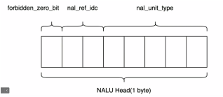

## NALU
* Network Abstration layer Unit 网络抽象层单元
 H264 的码流都是由一个一个的 NALU 单元组成的

H.264 码流当中没有音频，没有时间戳，除了图像本身的信息啥都没有

## H.264 的两种封装格式

* avcC(avc1)
* Annex-B

### Annex-B

为了分割每一个 NALU, Annex-B 封装格式中，在每一个 NALU 的前面使用四个字节（0x0001）或者三个字节(0x001)的起始码。因此每一个 NALU以起始码开始到下一个起始码结束。

对于两种起始码：

* 可能是 0x0001 也有可能是 0x001， 也有可能是两个交替进行使用
* 代码必须对两种起始码都做出兼容

#### Annex-B 防竞争字节

需要注意的是，在每一个 NALU 的内部可能存在数据为 0x0001, 或者 0x001。如果存在这种情况，如果不做特殊的处理，会导致错误的分割。这里 就需要使用防竞争字节序。

所谓的防竞争字节，就是在为每一个NALU添加起始码之前，先对整个NALU的数据进行遍历， 查找码流当中存在的 0x000, 0x001, 0x002, 0x003 的连续字节，并对它们做出下面的修改：

```
000 => 0030
001 => 0031
002 => 0032
003 => 0033
```

### avcC

* avcC 主要使用在 mp4 容器当中。在 mp4 当中，会使用 box 来存放信息，而表示 box 类型的 box type 是四个字节。所以通常会把三个字节的类型补充上一个字节，变成4个字节
* avc -> avcc
* avc -> avc1

Annex-B 的原理是在每一个 NALU 的前面加上一个特殊的起始码，通过这个起始码了作为 NALU 的分隔符号。而 avcC 采用的是另一种方式，那就是在 NALU 的前面加上几个字节，这几个字节组成一个整数， 在读取一个 NALU 之前，先将这个整数读出来，拿到整个 NALU 的长度，然后按照这个长度数据读取整个NALU。

## SPS PPS

SPS 和 PPS 是两路特殊的 NALU, SPS 和 PPS 当中存放了一路 H.264 码流的必要的参数信息。也就是 说，你想要解码一路的 H.264 码流，就必须先获取到 SPS 和 PPS。

在 Annex-B 中，SPS 和 PPS 被当成了普通的 NALU 来进行处理，而在 avcC 当中，SPS 和 PPS 信息被当做特殊的信息来进行处理。

## avcC 的结构

| 长度(bits) | 名称                                           | 备注                                |
| ---------- | ---------------------------------------------- | ----------------------------------- |
| 8          | version                                        | 总是等于 0x01                       |
| 8          | avc profile                                    |                                     |
| 8          | avc compatibility                              |                                     |
| 8          | avc level                                      |                                     |
| 6          | reserved                                       |                                     |
| 2          | NALU Length Size Minus One                     | NALU Body length 数据存储的长度 - 1 |
| 3          | reserved                                       |                                     |
| 5          | number of SPS NALUs                            | 有几个 SPS, 一般情况下是1个         |
|            | for (int i = 0; i< number of SPS NALUs; ++i) { |                                     |
| 16         | SPS size                                       | 每一个 SPS 的数据大小               |
|            | SPS NALU data                                  | SPS NALU 数据                       |
|            | }                                              |                                     |
| 8          | number of PPS NALUs                            | 有几个 PPS,一般情况下为 1           |
|            | for (int i =0; i<number of PPS NALUs;++i){     |                                     |
| 16         | PPS size                                       | 每一个PPS的数据的大小               |
|            | PPS NALU data                                  | PPS NALU 数据                       |
|            | }                                              |                                     |

## Nalu 的第一个字节



### forbidden_zero_bit

* 禁止位，正常的情况下这一位的数据一定是0。 在某些情况下，如果 Nalu 发生了丢失数据的情况，可以将这个位设置为1，以方便接收方进行纠错或者丢掉这个单元

### nal_ref_idc

* 重要性，表示这个 Nalu 是否重要
* 在网络传输的过程中，可以作为该Nalu 是否可以丢弃的标志（一般也没有人真的把它当做标识）

| nal_ref_idc | 重要性     |
| ----------- | ---------- |
| 3           | HIGHEST    |
| 2           | HIGH       |
| 1           | LOW        |
| 0           | DISPOSABLE |

### nal_unit_type

* 这个字段表示 Nalu 的类型
* 不同的类型有不同的功能，也有不同的解析方式

| nal_unit_type | Nalu 类型                          |      |
| ------------- | ---------------------------------- | ---- |
| 0             | 未定义                             |      |
| 1             | 非IDR slice                        |      |
| 2             | 非IDR slice, 采用A类型数据划分片段 |      |
| 3             | 非IDR slice, 采用B类型数据划分片段 |      |
| 4             | 非IDR slice, 采用C类型数据划分片段 |      |
| 5             | IDR Slice                          |      |
| 6             | 补充增强信息 SEI                   |      |
| 7             | 序列参数集 SPS                     |      |
| 8             | 图像参数集 PPS                     |      |
| 9             | 分隔符                             |      |
| 10            | 序列结束符                         |      |
| 11            | 码流结束符                         |      |
| 12            | 填充数据                           |      |
| 13            | 序列参数扩展集                     |      |
| 14-18         | 保留                               |      |
| 19            | 未分割的辅助编码图像的编码条带     |      |
| 20-23         | 保留                               |      |
| 24-31         | 未指定                             |      |

### nalu_unit_type = 7,8

* sps pps
* SPS 和 PPS 中存放了解码过程中所需要的各种参数，是H.264 解码的前置条件，没有 SPS 和 PPS， 视频将无法进行解码，所以在解码的时候，我们总是首先把SPS和 PPS 传递给解码器，供解码器进行初始化。

### nalu_unit_type = 6

* SEI
* 当 nalu_unit_type 的值等于6的时候，这个 nalu 被称之为 SEI， 也就是自定义信息，如果你想在一路码流里面放入一些额外的信息，就可以把这些信息写到SEI当中。不过需要注意的是，SEI信息的重要性级别并不高，有时候在转码或者转封装的过程中这些数据可能被丢弃

### nalu_unit_type = 5

* IDR
* 当 nalu_unit_type 等于 5 的时候，这个 nalu被称之为 IDR帧，也叫做关键帧。

### nalu_unit_type = 1

* Slice
* 当 nalu_unit_type 等于 1 的时候，这个 nalu 被称之为 slice， 这里就是除了 IDR slice以外，其他的视频数据存放的位置。其实，除了IDR的特殊属性之外，IDR slice 和普通的 slice 在组成和解码原理上，几乎是一模一样的。

