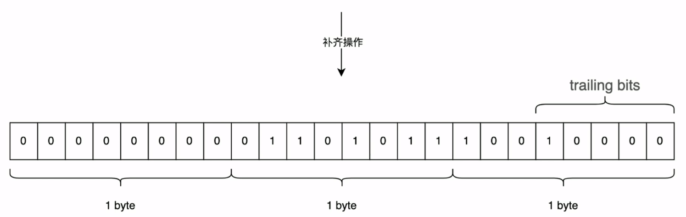

# 解析 SPS PPS 数据

## 1. EBSP 扩展字节序载荷
- 首先要说明的是， H.264 当中其实没有这个概念的。这个概念是出现在 JM 项目当中。在JM中，将带有 startcode 的 NALU，去掉startcode 之后的部分数据称之为 EBSP。在这里沿用这个概念


## 2. RBSP 原始字节序列载荷
- RBSP 是 H.264 标准当中的概念。要说 RBSP， 我们就需要提到前面说的一个概念，防竞争字节序。
- 我们知道，H.264 在编码的时候，会加上 0x03 的字节来防止和 startcode 产生混淆。而在读到 Nalu 之后，我们就需要把编码时候加上的防竞争字节去掉。
- 而将 NALU 去掉 startcode， 接着又去掉防竞争字节之后的数据，就叫做 RBSP
![[RBSP_Structure_Image.png]]

## 3. SODB 数据比特串
- 视频在编码的时候，会以bit 作为单位把数据写入到码流里面，而在写完之后，有可能存在的情况就是写入的数据不满一个字节。

一个例子：


> 上面的图中我们可以看到，码流的数据一共是 19 个 bits， 两个完整的字节 + 3 个独立出来的 bits。这种情况在实际的操作当中会很不方便，所以在构建 RBSP 的时候，会对不满一个字节的情况进行补齐

```cpp
rbsp_trailing_bits() {
	// 先在码流结束的位置补上一个 1
	rbsp_stop_one_bit // equal to 1
	// 之后一直补0， 直到整个码流补充到字节对齐为止
	while (!byte_aligned()) 
		rbsp_alignment_zero_bit // equal to 0
}
```

那么对于上面这个例子，会进行下面这种补齐：



---
如果一个码流刚好写完所有的数据之后正好是整数字节，没有任何多余的 bit。这个时候依然需要做补0的操作。操作的方法就是在码流的后面追加一个字节，100000000。


## 4. 获取典型值-视频的常和宽
### 4.1 宏块
- 在 H.264 当中，我们通常不是逐个像素去进行处理，而是把图像按照固定的长宽划分为一个一个的小块，然后按照各个小块作为单位进行处理，而这些小块，我们称之为宏块。
- 假如我们有一个图像，宽度为 176 个像素，高度为 144 个像素，按照 H.264 的标准的规定，一个宏块宽度为 16 个像素，高度为16个像素，那么这个图像就是按照下面的图进行划分
  
> 上面的图像大小为 176x144， 我们可以看见，被分成了 11x8 = 88 个宏块

```cpp
if (nalu.mNal_unit_type == 7) { //sps
	NaluSPS sps {nalu};
	sps.Parse();
	log_info("(pic_width_in_mbs_minus1, pic_height_in_mbs_minus1) = (%d, %d)", sps.pic_width_in_mbs_minus1, sps.pic_height_in_map_units_minus1);
	int video_width = (sps.pic_width_in_mbs_minus1 + 1) * 16;
	int video_height = (sps.pic_height_in_map_units_minus1 + 1) * 16;
	log_info("(width, height) = (%d, %d)", video_width, video_height);
	break;
}
```
但是这里有一个值得关注的问题，如果视频都是被分为大小 16x16 的宏块，那么应该所有的 H.264 编码的视频长和寛都应该是 16 的倍数，但是实际上很多视频的长和宽都不是 16 的倍数。

### 4.2 frame_crop_xxx_offset
> 对于长度和宽度不是 16 的倍数的视频，我们需要对长和宽进行修正

- 在 sps 中，还有4个量， 它们在 frame_cropping_flag 为 1 的时候显式存放，其他的时候值是0
- 这四个值分别表示图像的上下左右的偏移。因为宏块是 16 的倍数，当视频的宽和高不是 16 的倍数的时候，H.264会在图像的边缘的位置添加一些像素，将视频的宽和高都补齐为 16 的倍数，然后通过 frame_crop_left_offset, frame_crop_right_offset,frame_crop_top_offset,frame_crop_bottom_offset 这四个量来记录上下左右补齐了多少的数据。
- 我们把这个过程称之为 Crop

> 在从 sps 当中获取视频的长和宽的信息的时候，还需要考虑一种特殊的情况，就是场编码

### 4.3 场编码
- 首先要考虑的特殊情况就是场编码。现在我们的视频大部分都是帧编码，但是存在场编码的情况。在场编码中，一帧等于两场。场的竖直宏块的数量是帧编码的一半， 而在场中，crop 1个像素，相当于对帧 crop 2个像素， 所以 frame_crop_xxx_offset 也需要做特殊的处理。
- 在 sps 中，frame_mbs_only_flag 用来表示场编码的相关信息， frame_mbs_only_flag 等于1 的时候，表示都是帧编码，它的值等于0的时候，表示可能存在场编码。
### 4.4 YUV420  YUV422  YUV444

- 对于 YUV420 来说，4个 Y 公用一组的 UV， 你去掉一排的 Y， 就会导致剩下部分的数据不完整。所以，对于 YUV420 来说，只能减去偶数个像素；对于 YUV422 来说，竖直方向上可以减去任意个数的像素，但是水平的方向只能减去偶数个像素
- 而 H.264 的 Crop 量， 在 420 上是要乘上 2 的，在 422 上，水平的方向是要乘以 2 的。

>  所以我们必须要知道我们的视频像素的 YUV 的值是如何进行排布的

| **值**                 | **像素的采样方式** |
|-----------------------|-------------|
| chroma_format_idc = 0 | 单色          |
| chroma_format_idc = 1 |  YUV420     |
| chroma_format_idc = 2 | YUV422      |
| chroma_format_idc = 3 | YUV444      |

> chroma_format_idc 的默认值是1。

### 4.5 separate_colour_plane_flag 
- 当你的图像为 YUV444 的时候，YUV 三个分量的比重是相同的，那么这种情况下有两种编码方式
- 第一种：就是默认的格式，UV分量依附在 Y 分量上
- 第二种：就是把 UV 和 Y 分离开，独立出来
- separate_colour_plane_flag 这个值的默认值是0， 表示UV依附于Y，和Y 一起进行编码，如果 separate_colour_plane_flag 的值是1， 那么表示 UV 和 Y 分开进行编码，而对于分开进行编码的模式，我们采样和单色模式相同的规则。

```cpp
if (this->separate_colour_plance_flag == 0) {
	this->ChromeArrayType = chroma_format_idc;
} else {
	this->ChromeArrayType = 0;
}
```

---
## 相关网页
[H264 码流格式](https://winddoing.github.io/post/35564.html)
[从H.264码流中一眼读出其Profile和Level](https://juejin.cn/post/6844904191891079175)
